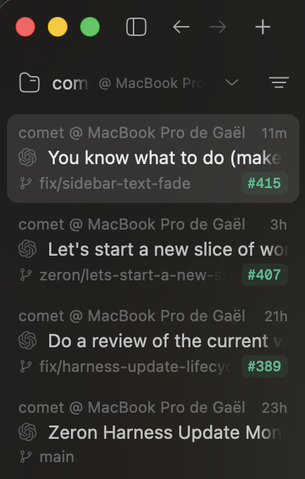

# Sidebar fade CPU comparison

Measured 2026-09-16 on Apple M4, macOS 26.6.2, Rust 1.96.0.

| Version | Idle CPU % median (range) | 60 Hz redraw CPU % median (range) | Redraw CPU ms/frame median |
| --- | ---: | ---: | ---: |
| Ellipsis baseline | 0.29 (0.19–0.33) | 30.57 (23.70–40.02) | 5.095 |
| Whole-glyph fade (20 px) | 0.30 (0.27–0.49) | 37.23 (34.57–42.36) | 6.206 |
| Per-pixel fade + smooth onset (20 px) | 0.29 (0.23–0.33) | 34.42 (28.24–37.54) | 5.739 |

The per-pixel version’s median redraw CPU is **3.86 percentage points above ellipsis** and **2.81 points below the earlier whole-glyph fade**. Idle medians are effectively unchanged. The redraw ranges overlap substantially, so these dev-build samples do not establish a reliable production speedup or regression.

CPU % is process user + system CPU seconds divided by wall seconds; 100% means one CPU core. These are native offscreen **UI-process** measurements, not whole-app CPU, GPU timing, or battery usage. Three fresh-process trials per version; ranges above are min–max, not confidence intervals.

## Workload and controls

The same `macos-resource-profile` driver from `6f1a7739` runs a 1320 × 880 logical-pixel window with native CoreText/Metal, dark appearance, 25 synthetic sessions, long conversation titles and branch names, and an empty transcript. The ready-state notification settles the startup overlay before measurement. Each process warms for 180 frames (3 s), then runs 600 paced idle frames (10 s) and 600 forced window-refresh frames (10 s), all at 60 Hz. Screenshot readback, font/setup work, and process shutdown are outside the measured intervals.

Builds use the same repository dev profile (application opt-level 0; dependency opt-level 2). Builds completed before measurement. The order rotates: ellipsis/whole-glyph/per-pixel, per-pixel/ellipsis/whole-glyph, whole-glyph/per-pixel/ellipsis. No engine or network workload is driven. Normal host background activity remains uncontrolled; small differences within the observed ranges should not be treated as established speedups or regressions. No release-build, Windows-CPU, live-resize, or streaming-transcript performance claim is made.

## Source provenance

| Variant | Application source | Renderer |
| --- | --- | --- |
| Ellipsis | `720501437f18aef8b303edb4a3fd1a2d385fd2f7` + identical profiler driver | `c2d273dc3dadcb260b0fa7c35fc2fe02a14f5add` |
| Whole-glyph fade | `8b0a7b2e589d27c09cc3d81f39daddd4b84d7abf` + identical profiler driver | `c2d273dc3dadcb260b0fa7c35fc2fe02a14f5add` |
| Per-pixel + onset | source tree committed as `6f1a7739` (binary built immediately before commit) | `53869c204efb866d19af292cab8b1773898eeedd` |

The same driver SHA-256 was used for all variants: `3efff1035faf6f7bce318bc48ac6345cd25f1b69b671262d27cdf3859f5c5834`. Binary SHA-256 values and all raw phase results are in [performance-sidebar-fade.json](performance-sidebar-fade.json). The whole-glyph versus per-pixel comparison includes the app's smooth-onset change as well as the renderer change; it does not isolate shader work alone.

## Reproduction

Copy `crates/ui/examples/macos-resource-profile.rs` from `6f1a7739` onto each source revision above. Build each serially with:

```sh
cargo build -p zeron-ui --features resource-profile --example macos-resource-profile
```

Copy each resulting `target/debug/examples/macos-resource-profile` to an immutable path before building the next version, then run:

```sh
python3 scripts/profile-sidebar-fade.py /tmp/fade-cpu-results /path/to/ellipsis /path/to/whole-glyph /path/to/per-pixel
```

The runner sets `ZERON_PROFILE_SIDEBAR_FADE=1`, `ZERON_PROFILE_BACKGROUND_CHATS=24`, and `ZERON_VERIFY_SIDEBAR_ROWS=1`; each process receives a separate output/settings directory. It records process CPU using `getrusage(RUSAGE_SELF)`. The offscreen platform has no native menu/delegate, and the driver initializes component/history globals before revealing the fixture. Failed setup/smoke runs are excluded; only the nine completed settled-fixture runs appear in the data.

## Supplied visual preview



Provided by the user for the PRs. Its exact running build was not recorded; it is visual context, not a controlled before/after performance capture.
